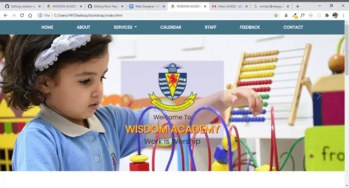
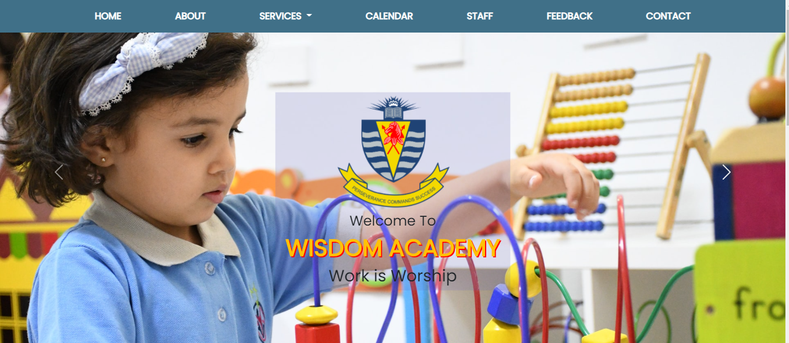

# wisdom-academy

This is an interface of school webite designed for the purpose of learning. It shows different facilites a school provides. It has various sections providing about, services, staff, feedback, contact, staff and calendar. It provides Form Validation using JavaScript.
The site is made responsive such that it runs in all devices.

**Technologies Used are**: HTML5, CSS3, Bootstrap5 and JavaSctript.

**References of the code used**:

*BOOTSTRAP*: https://v5.getbootstrap.com/

*FontAwesome*: https://fontawesome.com/

*GoogleFonts*: https://fonts.google.com/

